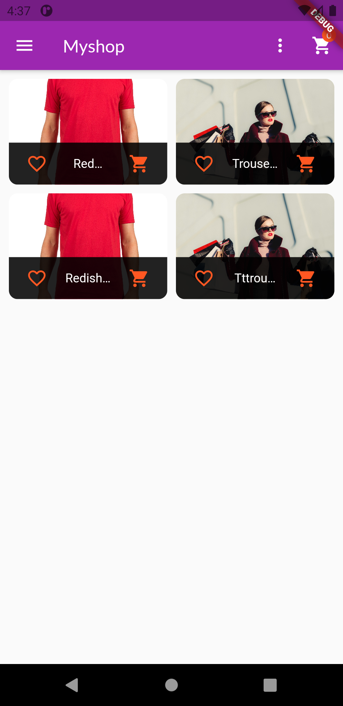
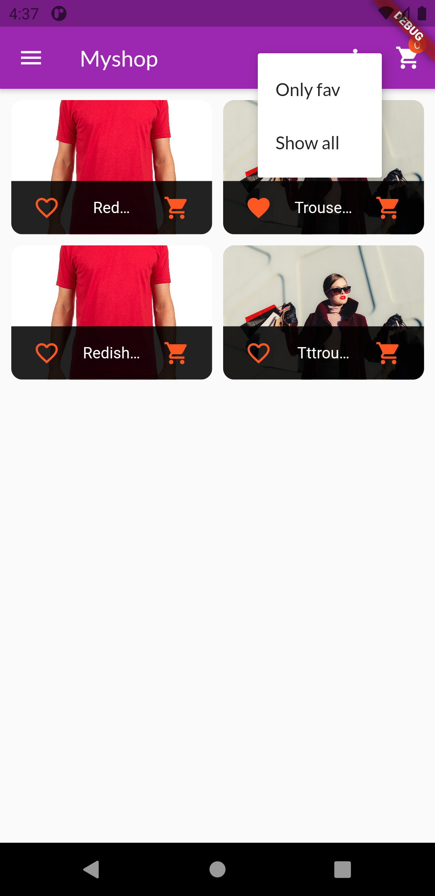
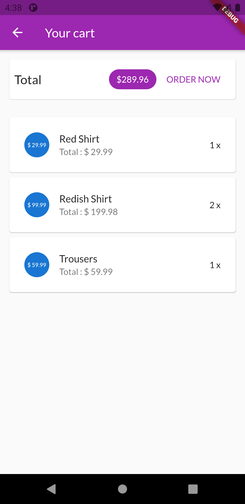
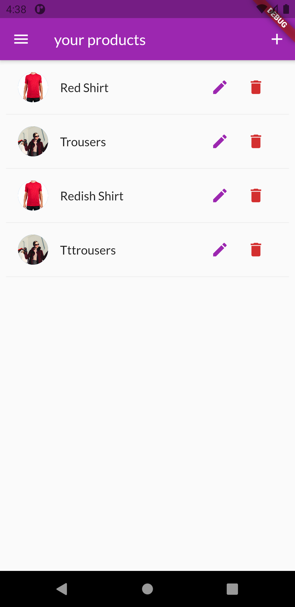
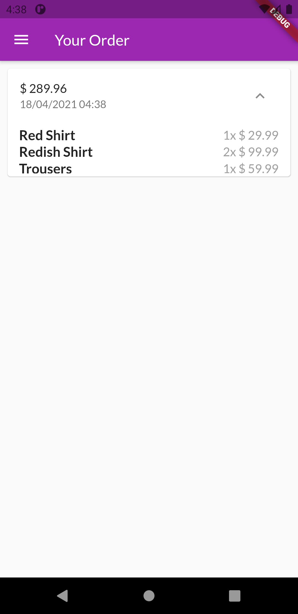
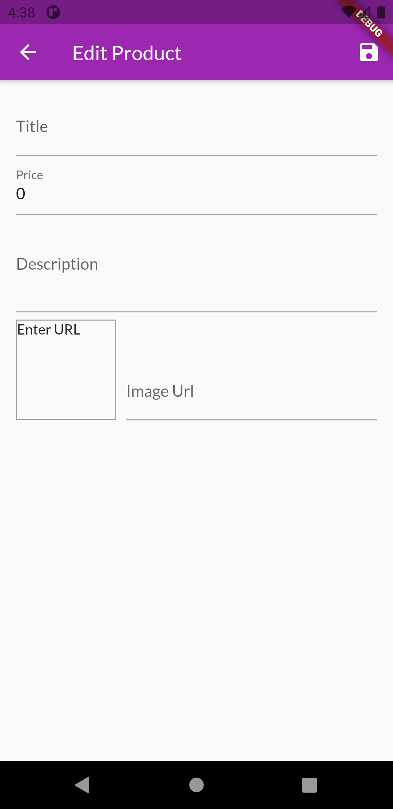
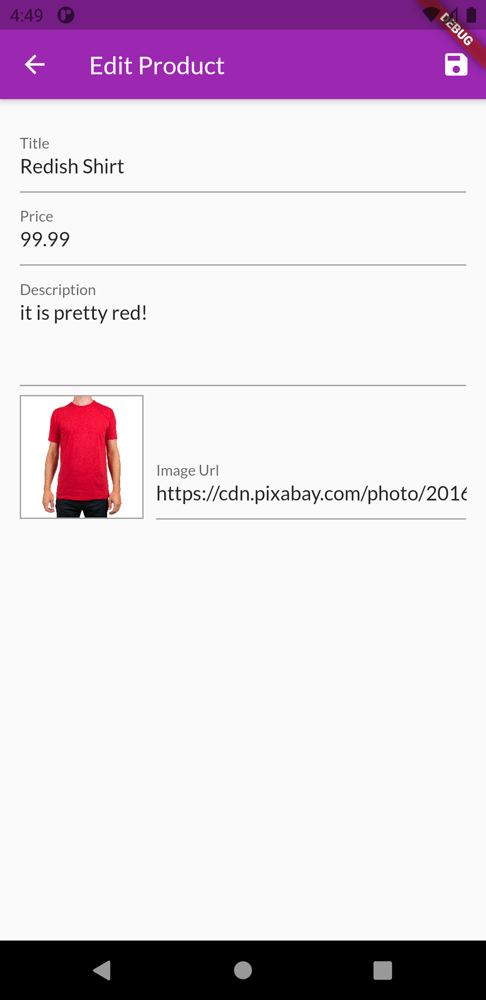

# MyShop App
An e-commerce app which allows users to buy and sell items.
Uses Firebase Realtime Database .

### Installation and Setup

* Fork the repo and clone it.
```
https://github.com/vikiwarrior/MyShop.git
```
* In the same directory run the following commands(considering you have flutter installed and an android device connected)
```
flutter packages get
flutter run
```

### Preview

|  |  |  |
|:--------------------------|:--------------------------|:--------------------------|
|  |  |  |
|  |                 
